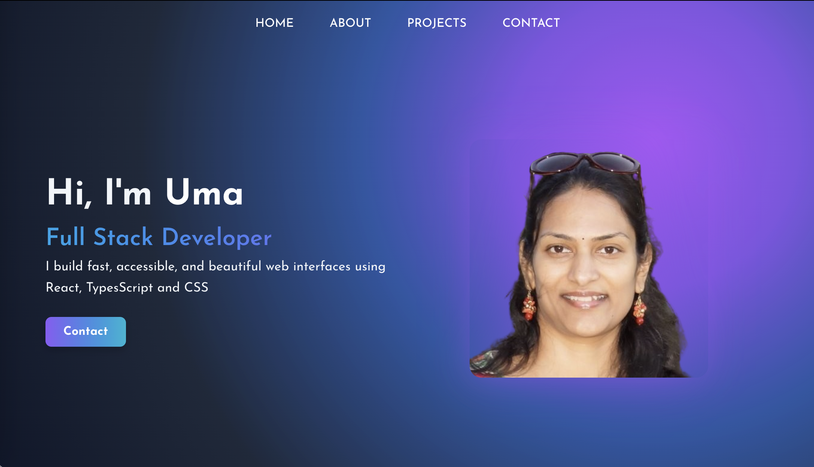
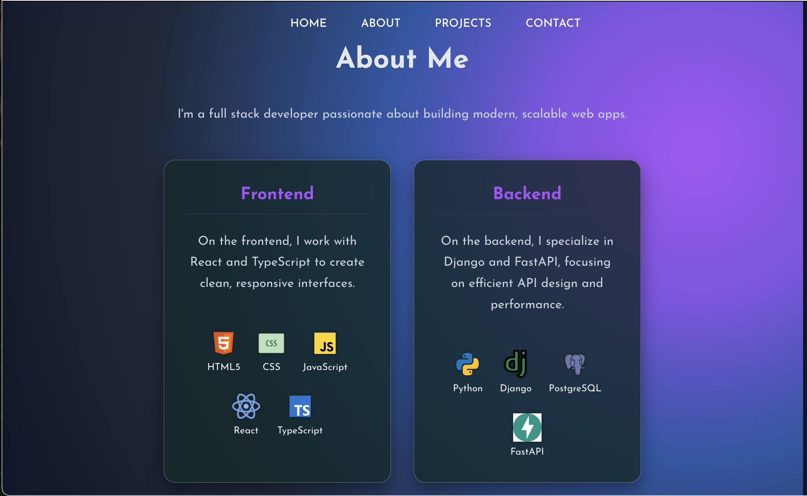
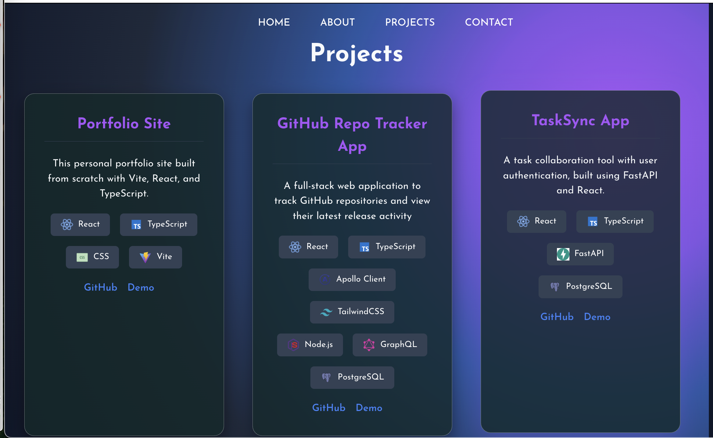

# my_portfolio_app

# 🌐 Developer Portfolio - Built with React, TypeScript & FastAPI

Welcome to my personal developer portfolio — a fully responsive, visually rich website to showcase my projects, skills, and experience.

Built from scratch using modern frontend and backend technologies.

## 📸 Screenshots

### 🏠 Home Section



### 🙋‍♀️ About Section



### 🛠️ Projects Section



## 🚀 Live Demo

🌍 [View Live Portfolio](https://my-portfolio-app-sable.vercel.app/)

## 🛠️ Tech Stack

### Frontend

- ⚛️ React
- 💙 TypeScript
- 🎨 CSS3
- ⚡ Vite
- 💅 Custom Animations & Responsive Design

### Backend (Projects API)

- 🐍 Python
- 🌐 FastAPI
- 🛢️ PostgreSQL

## 📂 Folder Structure

````bash
src/
├── assets/           # images and tech logos
├── components/       # reusable UI components
│   ├── HomeSection/
│   ├── AboutSection/
│   ├── ProjectsSection/
│   ├── ContactSection/
│   └── Header/
├── constants/        # tech logo mappings
├── pages/            # main page structure
├── styles/           # global and section CSS
└── App.tsx

## 🧰 Getting Started

### 1. Clone the repository

```bash
git clone https://github.com/umastotra/my_portfolio_app.git
cd my_portfolio_app
````

### 2. Install dependencies

```bash
npm install
```

### 3. Run the development server

View the site at http://localhost:5173/

```bash
npm run dev
```

### 4. Build for production

```bash
npm run build
```

## 🖼️ Customize

- Update `src/assets/tech/` with your preferred icons
- Modify project list in `ProjectsSection.tsx`
- Update content in `AboutSection.tsx` and `ContactSection.tsx`

## 💡 Features

- ✨ Seamless radial-gradient design with scrollable transitions
- 🧠 Frontend/Backend skills visualized with icons
- 🧩 Modular component structure
- 🌍 Deployed with [Vercel](https://vercel.com/)

## 📬 Contact

📧 [your.email@example.com](mailto:your.email@example.com)
🔗 [LinkedIn](https://linkedin.com/in/yourprofile)
💻 [GitHub](https://github.com/yourusername)

---

## 📝 License

This project is open-source and free to use.

---
